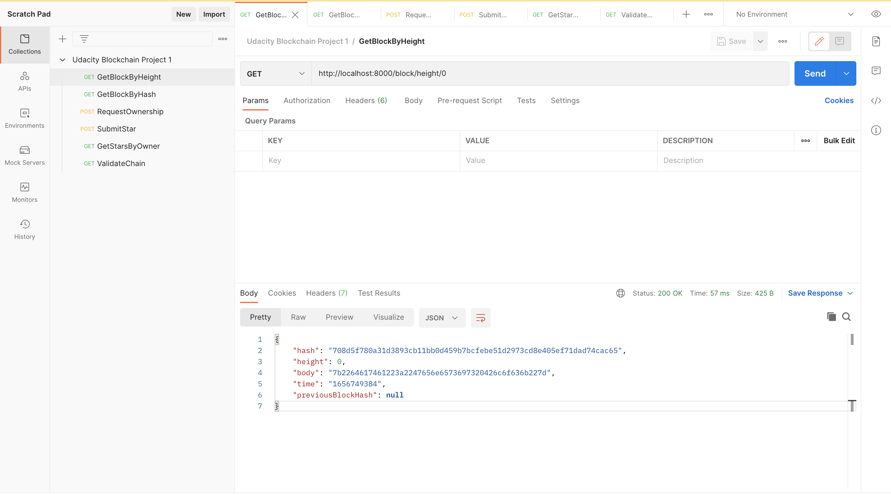
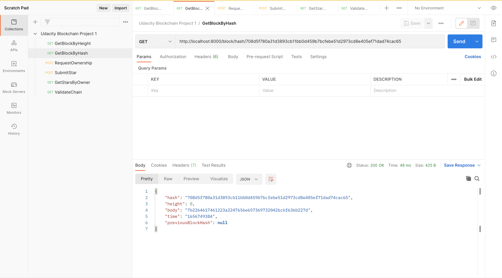
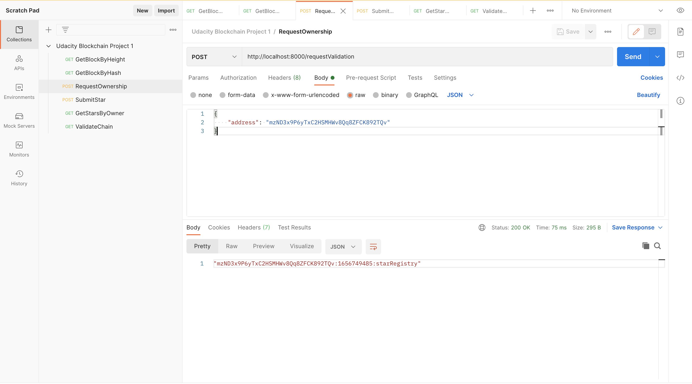
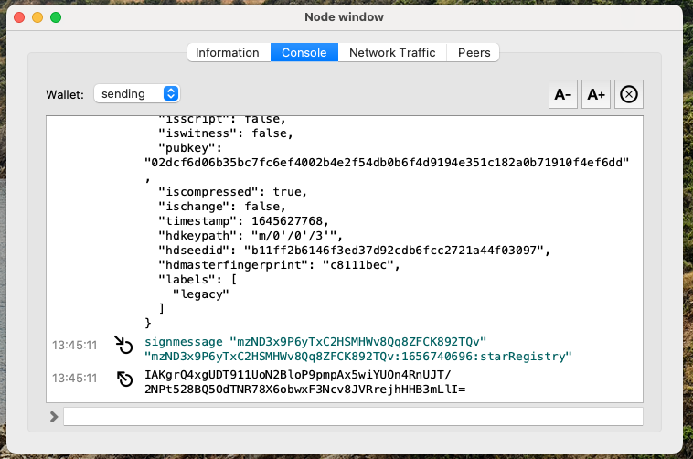
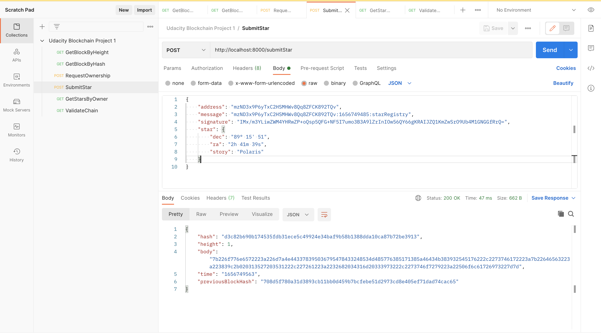
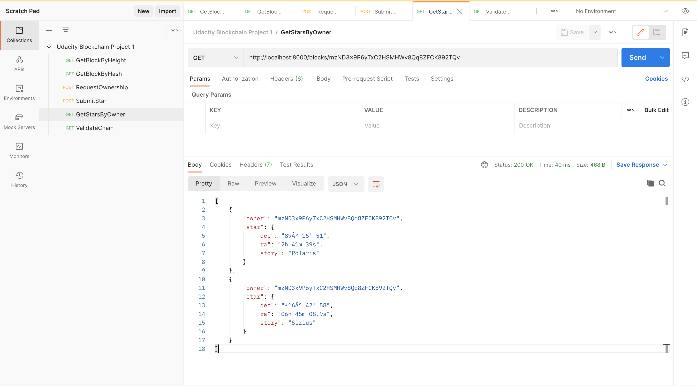
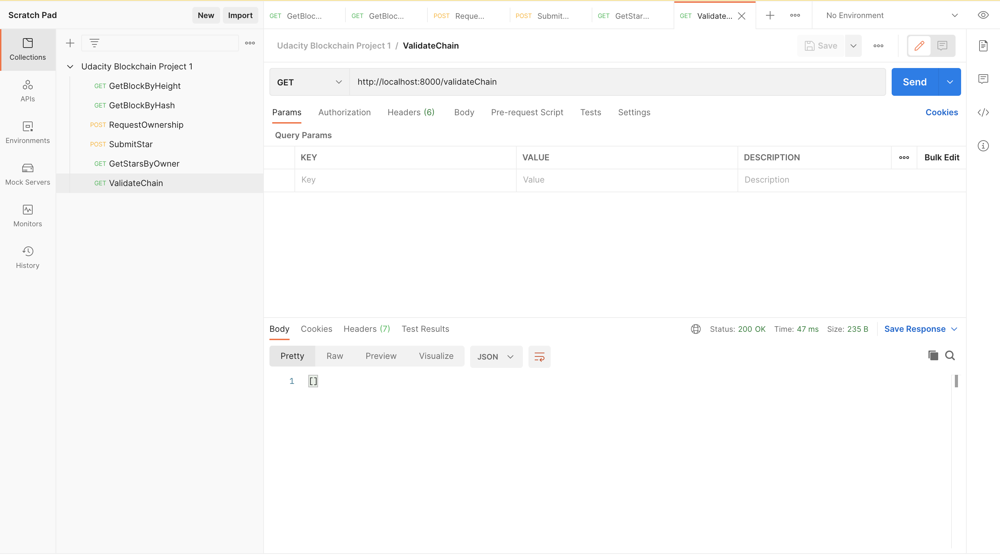

# Private Blockchain Application

UDACITY: Standard Chartered Blockchain Developer Scholarship Program
Project 1: Create Your Own Private Blockchain

## Application Purpose

- The application will create a Genesis Block when we run the application.
- The user will request the application to send a message to be signed using a Wallet and in this way verify the ownership over the wallet address. The message format will be: `<WALLET_ADDRESS>:${new Date().getTime().toString().slice(0,-3)}:starRegistry`;
- Once the user have the message the user can use a Wallet to sign the message.
- The user will try to submit the Star object for that it will submit: `wallet address`, `message`, `signature` and the `star` object with the star information.
    The Start information will be formed in this format:

```json
    "star": {
        "dec": "-16° 42' 58",
        "ra": "06h 45m 08.9s",
        "story": "Sirius"
    }
```

- The application will verify if the time elapsed from the request ownership (the time is contained in the message) and the time when you submit the star is less than 5 minutes.
- If everything is okay the star information will be stored in the block and added to the `chain`
- The application will allow us to retrieve the Star objects belong to an owner (wallet address).

## Tech Stack

- This application is created using Node.js and ES6 Javascript programming language.
- Visual Studio Code is used as an IDE.
- Some of the libraries or npm modules used are:
  - "bitcoinjs-lib": "^4.0.3",
  - "bitcoinjs-message": "^2.0.0",
  - "body-parser": "^1.18.3",
  - "crypto-js": "^3.1.9-1",
  - "express": "^4.16.4",
  - "hex2ascii": "0.0.3",
  - "morgan": "^1.9.1",
  - "nodemon": "^2.0.18"

Libraries purpose:

1. `bitcoinjs-lib` and `bitcoinjs-message`. Those libraries will help us to verify the wallet address ownership, we are going to use it to verify the signature.
2. `express` The REST Api created for the purpose of this project it is being created using Express.js framework.
3. `body-parser` This library will be used as middleware module for Express and will help us to read the json data submitted in a POST request.
4. `crypto-js` This module contain some of the most important cryptographic methods and will help us to create the block hash.
5. `hex2ascii` This library will help us to **decode** the data saved in the body of a Block.
6. `morgan` This library is a HTTP request logger middleware for Node.js. It helps with debugging and logging.
7. `nodemon` This library helps develop Node.js based applications by automatically restarting the node application when file changes in the directory are detected.

## Project Structure

1. `app.js` file. It contains the configuration and initialization of the REST Api.
2. `BlockchainController.js` file. It contains the routes of the REST Api. Those are the methods that expose the urls you will need to call when make a request to the application.
3. `src` folder. In here we are going to have the main two classes we needed to create our Blockchain application, we are going to create a `block.js` file and a `blockchain.js` file that will contain the `Block` and `BlockChain` classes.

## How to Test the application?

- Install the package dependencies using the command `npm install`
- Run the application using the command `npm start`

You should see in your terminal a message indicating that the server is listening in port 8000:
> Server Listening for port: 8000

- To make sure the application is working fine and it creates the Genesis Block you can use POSTMAN to request the Genesis block:
    

- Get block by hash
    

- Make your first request of ownership sending your wallet address:
    

- Sign the message with your Wallet:
    

- Submit your Star
    

- Retrieve Stars owned by me
    

- Validate Chain
    
